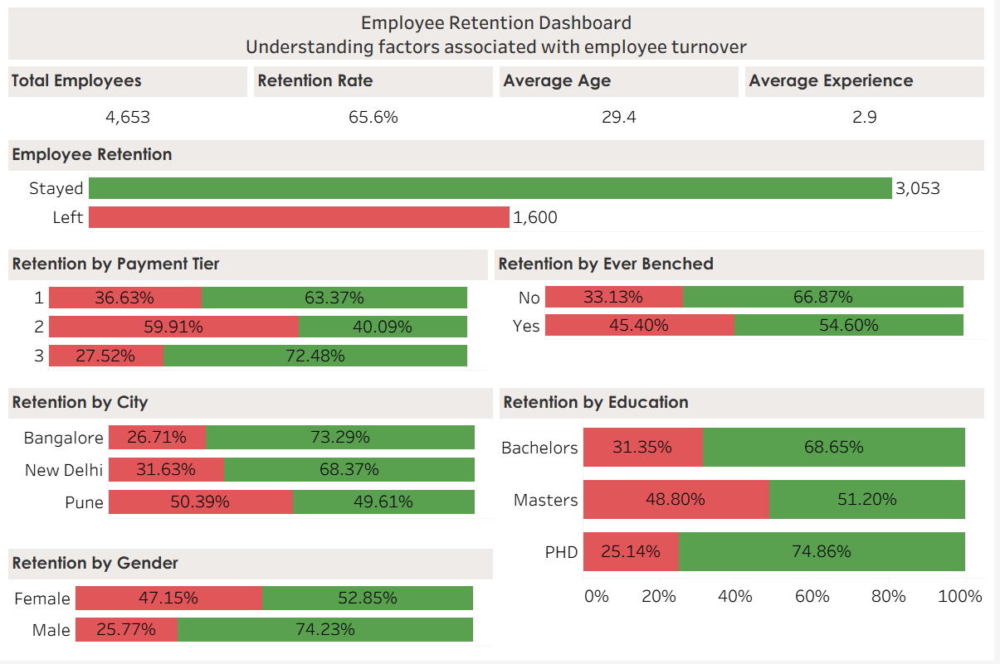

# Employee Retention Analysis

## Project Overview

This project analyses an employee retention dataset using SQL and Tableau to identify factors that influence employee turnover. The aim was to clean the data, answer business questions using SQL, and present the findings in an interactive dashboard.

---

## Dataset

The dataset contains information on over 4,000 employees, including:

- Education
- Joining Year
- City
- Payment Tier
- Age
- Gender
- Ever Benched
- Experience in Current Domain
- Leave or Not (target variable)

---

## Tools Used

- Microsoft Excel
- MySQL
- Tableau

---

## Project Process

- Imported and explored the dataset.
- Cleaned and validated the data.
- Performed data analysis using SQL.
- Answered business questions using SQL queries.
- Created KPIs and visualisations in Tableau.
- Built an interactive dashboard to communicate the findings.

---

## Key Business Questions

- What is the overall employee retention rate?
- Does payment tier influence employee retention?
- Does education affect retention?
- Which cities have the highest employee turnover?
- Are employees who have been benched more likely to leave?
- Does gender influence retention?

---

## Key Findings

- Overall employee retention was approximately **65.6%**.
- Employees in **Payment Tier 2** showed the highest turnover.
- Employees who had been **benched** were significantly more likely to leave.
- Retention rates varied across cities and education levels.
- Gender showed only a relatively small difference in retention.

---

## Dashboard



---

## Repository Structure

```
employee-retention-analysis/
│
├── README.md
├── dashboard.png
├── sql/
│   └── sql_queries.sql
├── tableau/
│   └── Employee_Retention_Dashboard.twbx
└── data/
    └── employee_clean.csv
```

---

## Skills Demonstrated

- SQL
- Data Cleaning
- Exploratory Data Analysis (EDA)
- Business Analysis
- Tableau Dashboard Design
- KPI Development
- Data Visualisation